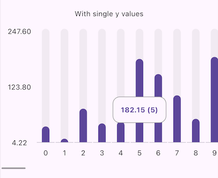
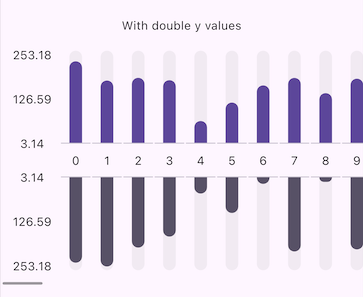

# 📊 Slider Bar Chart
<div style="display: flex;">
  
  
</div>
<br>
**Slider Bar Chart** is a lightweight and customizable Flutter library for creating simple bar charts. Ideal for visually comparing data in an elegant and minimalistic way.

## 🌟 Features

- **Flexible Configuration**: Customize titles, colors, and tooltips.
- **Support for Two Data Series**: Display charts with one or two Y-axis data series.
- **Customizable Tooltip**: Format and style tooltips to show contextual information.
- **Responsive Design**: Adjust chart height and layout for different screen sizes.
- **Horizontal Scroll**: The chart will auto enable scrollview on horizontal axis to fit all data.

## 🚀 Installation

Add `slider_bar_chart` to your `pubspec.yaml`:

```yaml
dependencies:
  slider_bar_chart: ^0.0.4
```

## 🛠️ Usage

### Basic Example
Import **slider_bar_chart** into your dart file:
```dart
import 'package:slider_bar_chart/slider_bar_chart.dart';
```

Create a **SliderBarChartWidget** instance:
```dart
SliderBarChartWidget(
    data: SbcData(
        xValues: List.generate(100, (index) => index),
        yValues: List.generate(
            100, (index) => Random().nextDouble() * 256),
    ),
),
```

Control the overall layout of the chart, including height, titles, bars, and tooltips:
```dart
SliderBarChartWidget(
    decoration: SbcDecoration(
        height: 300.0, 
        showScrollbar: true, 
        singleBarPosition: SingleBarPosition.bottom, // Default value
        titleDecoration: SbcTitleDecoration(
            xHeightSpace: 40.0,
            xWidthSpace: 35.0,
            showYTitles: true,
            yTitleTextFormatter: null,
            fixedYTitles: false,
            yTitlePosition: YTitlePosition.both,
        ),
        tooltipDecoration: SbcTooltipDecoration(
            backgroundColor: null,
            triggerMode: TooltipTriggerMode.tap,
            waitDuration: Duration.zero,
            padding: EdgeInsets.all(15.0),
            yTextFormatter: null,
            y2TextFormatter: null,
            border: null,
            borderRadius: 14
        ),
        barDecoration: SbcBarDecoration(
            barWidth: 15.0,
            showAsProgress: true,
            yColor: null,
            y2Color: null,
        ),
    ),
    data: SbcData(
        xValues: List.generate(100, (index) => index),
        yValues: List.generate(
            100, (index) => Random().nextDouble() * 256),
    ),
),
```